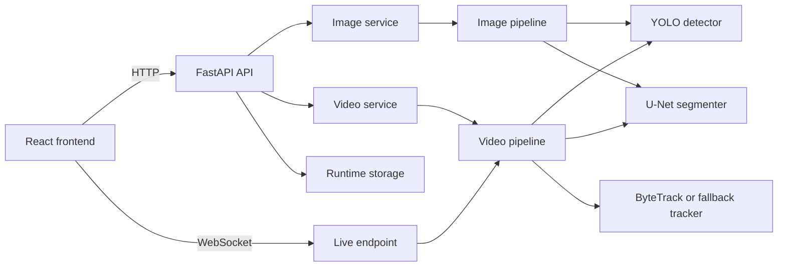

# ENDO-X

<div align="center">

**AI-assisted gastrointestinal endoscopy analysis**

Detection, segmentation, tracking, and live camera inference through a FastAPI backend and React frontend.

[](https://www.python.org/)
[](https://fastapi.tiangolo.com/)
[](https://react.dev/)
[](https://pytorch.org/)
[](https://opencv.org/)

</div>

> **Research and education only.** ENDO-X is not a medical device, is not clinically validated, and must not be used for diagnosis or medical decision-making.

## Contents

- [Overview](#overview)
- [Capabilities](#capabilities)
- [Architecture](#architecture)
- [Repository Structure](#repository-structure)
- [Requirements](#requirements)
- [Model Files](#model-files)
- [Local Installation](#local-installation)
- [Configuration](#configuration)
- [Running the Application](#running-the-application)
- [API Reference](#api-reference)
- [Inference Behavior](#inference-behavior)
- [Testing](#testing)
- [Docker](#docker)
- [Vercel and ngrok Demonstration Deployment](#vercel-and-ngrok-demonstration-deployment)
- [Performance](#performance)
- [Troubleshooting](#troubleshooting)
- [Security and Privacy](#security-and-privacy)
- [License and Data](#license-and-data)

## Overview

ENDO-X is a modular computer-vision prototype for analyzing gastrointestinal endoscopy images and videos. It combines two AI models:

- **Object detection:** a YOLO checkpoint predicts polyp bounding boxes and confidence scores.
- **Semantic segmentation:** a U-Net checkpoint predicts the pixel region belonging to a polyp.
- **Tracking:** ByteTrack, when installed and available, maintains object IDs across video and live frames.

The application has three frontend modes:

1. **Image:** upload one image and receive detections, segmentation masks, an annotated image, and latency.
2. **Video:** upload a video and receive an annotated output video and processing summary.
3. **Live:** stream browser camera JPEG frames to the backend over WebSocket and receive annotated frames and telemetry.

## Capabilities

### Image analysis

- Supported extensions: `.jpg`, `.jpeg`, `.png`
- Maximum default size: 15 MB
- Returns detection boxes, confidences, segmentation polygons, mask area, overlay URL, and inference time.

### Video analysis

- Supported extensions: `.mp4`, `.avi`, `.mov`
- Maximum default size: 250 MB
- Processes every tenth frame by default to keep CPU inference usable.
- Reuses the last annotation on skipped frames.
- Preserves the source playback FPS in the generated output.
- Writes generated media to the runtime output directory.

### Live camera analysis

- Uses browser camera permission through `getUserMedia`.
- Sends JPEG frames through `/api/v1/predict/live`.
- Returns a base64-encoded annotated JPEG, detections, track IDs, FPS, and latency.
- HTTPS is required by browsers when the frontend is not running on localhost.

## Architecture



### Inference flow

```text
Input image/frame
      |
      +--> YOLO detector --------------------> detections and boxes
      |
      +--> U-Net segmenter ------------------> mask and contour
      |
      +--> tracker for video/live -----------> persistent IDs
      |
      +--> visualization --------------------> annotated output
```

Detection and segmentation are configurable. In the default `independent` mode, both models receive the same full image. In `detected_regions` mode, segmentation receives a crop for each detector box.

## Repository Structure

```text
ENDO-X/
├── backend/
│   ├── app/
│   │   ├── api/v1/              Health, image, video, and live routes
│   │   ├── core/                Settings, exceptions, and startup lifecycle
│   │   ├── domain/interfaces/   Detector, segmenter, and tracker protocols
│   │   ├── models/              YOLO, U-Net, and ByteTrack wrappers
│   │   ├── pipeline/            Image and video orchestration
│   │   ├── schemas/             Pydantic request/response models
│   │   ├── services/            Upload, inference, image, and video services
│   │   ├── storage/             Backend runtime storage mount points
│   │   └── utils/               Image, video, annotation, and visualization code
│   ├── Dockerfile
│   ├── .dockerignore
│   └── requirements.txt
├── frontend/
│   ├── public/
│   ├── src/
│   │   ├── api/                 Backend clients
│   │   ├── components/          Active live-camera component
│   │   └── styles/
│   ├── package.json
│   └── package-lock.json
├── models/                      Local ignored model weights
├── tests/                       Backend, pipeline, and model tests
├── training/                    Detector training and segmentation helper scripts
├── app/storage/                 Local ignored uploads and generated outputs
├── .env.example                 Public configuration template
├── docker-compose.yml
├── run_backend.bat
├── run_frontend.bat
└── README.md
```

## Requirements

- Python 3.10 or newer
- Node.js 18 or newer
- npm
- Git
- Optional: NVIDIA GPU and CUDA-compatible PyTorch for faster inference
- Optional: Docker Desktop for containerized backend development

The included model wrappers use PyTorch, Ultralytics, segmentation-models-pytorch,
OpenCV, and NumPy. Exact versions are pinned in `backend/requirements.txt`.

## Model Files

Model weights are deliberately excluded from Git because they can be large and may have separate licensing terms. Place the files locally at:

```text
models/detector/best.pt
models/segmenter/best.pth
```

The detector checkpoint must be compatible with Ultralytics YOLO. The segmenter checkpoint must match the configured architecture and encoder:

```env
SEGMENTER_ARCHITECTURE=unet
SEGMENTER_ENCODER_NAME=resnet34
```

Do not publish private patient data, trained checkpoints with unclear licensing,
or datasets that you are not authorized to redistribute.

## Local Installation

### 1. Clone the repository

```powershell
git clone https://github.com/Abdulrahman-Mahmoud-12/ENDO-X
cd ENDO-X
```

### 2. Create the Python environment

Windows PowerShell:

```powershell
python -m venv .venv
.\.venv\Scripts\Activate.ps1
python -m pip install --upgrade pip
pip install -r backend\requirements.txt
```

Linux or macOS:

```bash
python3 -m venv .venv
source .venv/bin/activate
python -m pip install --upgrade pip
pip install -r backend/requirements.txt
```

### 3. Create backend configuration

Copy the public template:

```powershell
Copy-Item .env.example .env
```

Then update `DETECTOR_MODEL_PATH` and `SEGMENTER_MODEL_PATH` if your weights are stored elsewhere.

Never commit `.env`. It is ignored by Git.

### 4. Install frontend dependencies

```powershell
cd frontend
npm ci
cd ..
```

## Configuration

The backend reads settings from the root `.env` file. Important values include:

| Variable                         | Default                     | Description                                |
| -------------------------------- | --------------------------- | ------------------------------------------ |
| `HOST`                           | `0.0.0.0`                   | Backend bind host                          |
| `PORT`                           | `8000`                      | Backend port                               |
| `DEVICE`                         | `auto`                      | `auto`, `cpu`, `cuda`, or `cuda:0`         |
| `DETECTOR_MODEL_PATH`            | `models/detector/best.pt`   | YOLO weights                               |
| `DETECTOR_IMAGE_SIZE`            | `640`                       | YOLO inference image size                  |
| `SEGMENTER_MODEL_PATH`           | `models/segmenter/best.pth` | U-Net weights                              |
| `SEGMENTATION_MODE`              | `independent`               | Full-image or detector-region segmentation |
| `DETECTION_CONFIDENCE_THRESHOLD` | `0.25`                      | Minimum detector confidence                |
| `DETECTION_IOU_THRESHOLD`        | `0.25`                      | YOLO NMS IoU threshold                     |
| `SEGMENTATION_MASK_THRESHOLD`    | `0.5`                       | Probability threshold for mask pixels      |
| `DETECTION_ROI_MARGIN`           | `0.15`                      | Crop expansion in region mode              |
| `MAX_IMAGE_SIZE_MB`              | `15`                        | Image upload limit                         |
| `MAX_VIDEO_SIZE_MB`              | `250`                       | Video upload limit                         |
| `LIVE_TARGET_FPS`                | `15`                        | Live-mode target setting                   |
| `CORS_ORIGINS`                   | local origins               | Comma-separated browser origins            |

### Segmentation modes

Independent full-image segmentation:

```env
SEGMENTATION_MODE=independent
```

This runs detection and segmentation separately on the same input image. The segmenter runs even when detection returns no boxes.

Detector-region segmentation:

```env
SEGMENTATION_MODE=detected_regions
```

This runs segmentation once for every detected bounding-box crop. Use this mode only when the segmentation checkpoint was trained on detector-style crops.

## Running the Application

### Backend

From the repository root:

```powershell
.\.venv\Scripts\Activate.ps1
$env:PYTHONPATH="$PWD\backend"
python -m uvicorn app.main:app --host 127.0.0.1 --port 8000 --reload
```

Or use:

```powershell
.\run_backend.bat
```

Open the API documentation at:

```text
http://localhost:8000/docs
```

### Frontend

In a second terminal:

```powershell
cd frontend
npm start
```

Open:

```text
http://localhost:3000
```

The frontend uses `frontend/.env` locally:

```env
PORT=3000
HOST=localhost
REACT_APP_API_URL=http://localhost:8000
```

### Available frontend modes

- **IMAGE:** choose an image, click `Analyze Image`, and inspect the original and annotated output.
- **VIDEO:** choose a video, click `Process Video`, and download/play the annotated output.
- **LIVE:** allow camera access, then start the WebSocket camera stream.

## API Reference

All versioned HTTP routes use the `/api/v1` prefix.

### Health

```http
GET /api/v1/health
```

Example response:

```json
{
  "status": "healthy",
  "app_name": "ENDO-X",
  "app_version": "0.1.0",
  "device": "cpu",
  "detector": "loaded",
  "segmenter": "loaded"
}
```

`status` becomes `degraded` when a required model is not loaded.

### Image prediction

```http
POST /api/v1/predict/image
Content-Type: multipart/form-data
```

Form field:

```text
file=<image file>
```

Optional query parameters:

```text
confidence_threshold=<0.0 to 1.0>
return_overlay=true|false
```

Example response shape:

```json
{
  "status": "success",
  "detections": [
    {
      "class": "polyp",
      "confidence": 0.91,
      "bbox": [120.0, 85.0, 430.0, 350.0]
    }
  ],
  "segmentations": [
    {
      "detection_index": -1,
      "mask_area_px": 18420,
      "polygon": [
        [130.0, 90.0],
        [200.0, 95.0]
      ]
    }
  ],
  "overlay_image_url": "/storage/outputs/result.png",
  "inference_time_ms": 842.5
}
```

A `detection_index` of `-1` identifies an independent full-image segmentation mask.

### Video prediction

```http
POST /api/v1/predict/video?sample_rate=10
Content-Type: multipart/form-data
```

The `sample_rate` value controls AI inference frequency. `sample_rate=10` means inference runs on frames 0, 10, 20, and so on; skipped frames reuse the most recent annotation.

Example response shape:

```json
{
  "status": "success",
  "output_video_url": "/storage/outputs/result.mp4",
  "summary": {
    "total_frames": 300,
    "frames_with_polyp": 120,
    "avg_fps": 0.2,
    "avg_latency_ms": 4800.0,
    "output_fps": 30.0
  }
}
```

`avg_fps` is model inference throughput. `output_fps` is the playback FPS of the generated file.

### Live WebSocket

```text
ws://localhost:8000/api/v1/predict/live
```

Send binary JPEG frame data. The server returns JSON:

```json
{
  "status": "success",
  "frame": "<base64 JPEG>",
  "frame_index": 0,
  "fps": 0.2,
  "latency_ms": 4800.0,
  "detections": [
    {
      "class": "polyp",
      "confidence": 0.91,
      "bbox": [120.0, 85.0, 430.0, 350.0],
      "track_id": 1,
      "frame_count": 4
    }
  ]
}
```

For HTTPS deployments, use `wss://` instead of `ws://`.

### Error responses

Handled API errors use this shape:

```json
{
  "status": "error",
  "error_code": "invalid_file_type",
  "message": "Unsupported file type"
}
```

Common error codes include `invalid_file_type`, `file_too_large`,
`decode_error`, `unsupported_video_format`, `corrupt_video`, and
`model_not_loaded`.

## Testing

Run the full test suite:

```powershell
.\.venv\Scripts\python.exe -m pytest -q
```

Run focused tests:

```powershell
.\.venv\Scripts\python.exe -m pytest -q tests\backend\test_health.py
.\.venv\Scripts\python.exe -m pytest -q tests\backend\test_live.py
.\.venv\Scripts\python.exe -m pytest -q tests\backend\test_pipeline_modes.py
.\.venv\Scripts\python.exe -m pytest -q tests\backend\test_video.py
```

Build the frontend:

```powershell
cd frontend
npm ci
npm run build
```

The real-weight image test depends on a checkpoint that detects the supplied fixture. If the local checkpoint returns zero detections, that test can fail even though the API and mocked pipeline tests pass; this indicates model/fixture mismatch rather than an HTTP contract failure.

## Docker

The backend image is defined in `backend/Dockerfile`. Compose mounts local model files and runtime storage:

```powershell
docker compose config
docker compose up --build backend
```

The backend is available at `http://localhost:8000`. The Compose frontend service is intended for development; for a hosted frontend, build the React app and deploy the `frontend/build` directory.

Do not bake private weights or `.env` files into a public image.

## Vercel and ngrok Demonstration Deployment

This setup hosts the static React frontend on Vercel and exposes the local FastAPI server through ngrok. It is suitable for demonstrations, not production.

### Start FastAPI

```powershell
$env:PYTHONPATH="$PWD\backend"
python -m uvicorn app.main:app --host 0.0.0.0 --port 8000
```

### Start ngrok

```powershell
ngrok config add-authtoken <YOUR_NGROK_TOKEN>
ngrok http 8000
```

Copy the HTTPS forwarding URL, for example:

```text
https://example.ngrok-free.app
```

Verify:

```text
https://example.ngrok-free.app/api/v1/health
```

### Configure Vercel

1. Import the repository into Vercel.
2. Set the project root directory to `frontend`.
3. Use `npm ci` as the install command.
4. Use `npm run build` as the build command.
5. Use `build` as the output directory.
6. Add this production environment variable:

```text
REACT_APP_API_URL=https://example.ngrok-free.app
```

7. Deploy or redeploy the frontend.
8. Add the final Vercel origin to `CORS_ORIGINS` in the backend `.env`.
9. Restart FastAPI.

The browser uses the HTTPS ngrok URL for HTTP and converts it to `wss://` for live camera inference.

Ngrok URLs can change after restart. Update the Vercel environment variable and redeploy whenever the URL changes.

## Performance

CPU inference can be slow because each sampled frame may run YOLO and U-Net. On a CPU-only machine, low inference FPS is expected. CUDA is recommended for live and dense video processing.

Performance controls:

- `DEVICE=cpu` or `DEVICE=cuda`
- `DETECTOR_IMAGE_SIZE`
- Video `sample_rate`
- Browser live-camera resolution and JPEG quality
- Optional `SEGMENTATION_MODE=detected_regions` when crop-based inference is appropriate

For CPU video demonstrations, increase `sample_rate` rather than claiming the output video itself has a low playback FPS. The generated file retains the source playback rate.

## Troubleshooting

### Backend appears offline in the frontend

1. Check `http://localhost:8000/api/v1/health` directly.
2. Confirm `REACT_APP_API_URL` does not include `/api/v1` twice.
3. Add the frontend origin to `CORS_ORIGINS`.
4. Restart FastAPI after editing `.env`.
5. Hard-refresh the browser.

### Models are not loaded

Check the paths and files:

```powershell
Test-Path models\detector\best.pt
Test-Path models\segmenter\best.pth
```

Then inspect `/api/v1/health` and backend startup logs.

### Output image has no segmentation

Check that:

- `SEGMENTER_MODEL_PATH` points to the correct checkpoint.
- `SEGMENTER_ARCHITECTURE` matches training.
- The mask area is not zero.
- The backend was restarted after configuration changes.

### Live camera is slow

CPU-only inference is the usual cause. Reduce camera resolution, reduce JPEG quality, or use a GPU. The live endpoint processes one frame at a time to avoid building a stale frame queue.

### WebSocket fails behind HTTPS

Use `wss://` for the WebSocket connection. Browsers block insecure `ws://` connections from an HTTPS Vercel page.

## Security and Privacy

- Do not commit `.env`, tokens, credentials, or private URLs.
- Do not commit patient-identifiable images or videos.
- Do not expose the development backend publicly without authentication and access controls.
- Validate upload size and extension limits before accepting media.
- Treat model files and datasets according to their licenses.
- Delete generated outputs regularly when handling sensitive data.

## License and Data

This repository should include a project license before public release. Add a `LICENSE` file appropriate for the project and document the licenses for:

- Model checkpoints
- Kvasir-SEG or other datasets
- External libraries and pretrained encoders
- Any downloaded sample media

If you cannot redistribute a model or dataset, document how users can obtain it instead of committing it to the repository.

## Acknowledgements

ENDO-X was developed as an educational graduation project for the NTI Summer Training Computer Vision track. The project builds on the open-source Python, PyTorch, Ultralytics, segmentation-models-pytorch, OpenCV, FastAPI, and React ecosystems.
